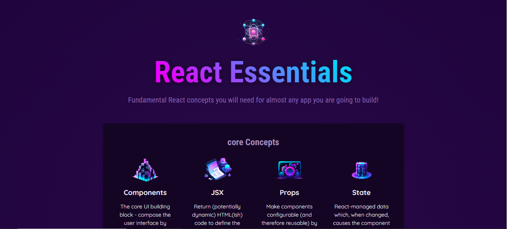

# 🌟✨ Essential React Components ✨🌟

Bienvenue dans mon projet **Essential React Components** ! 🎉 Ce projet est une démonstration de mes compétences en React, où j'ai appris à gérer les props, structurer mes composants, et produire du contenu dynamique. 🚀💻

## 🛠️🔧 Technologies Utilisées
- **React** - 🌐 Bibliothèque JavaScript pour construire des interfaces utilisateur interactives.
- **Vite** - ⚡ Un outil de construction rapide pour des applications React modernes.

## 🎯🔍 Fonctionnalités
- **Gestion des Props** : 📦 J'ai appris comment transmettre des données entre les composants en utilisant les props, ce qui permet une communication efficace et dynamique.
- **Structuration des Composants** : 🏗️ J'ai structuré mes composants de manière modulaire, facilitant ainsi leur réutilisation et leur maintenance.
- **Contenu Dynamique** : 🌈 Grâce à l'utilisation des états et des props, j'ai créé des interfaces réactives qui changent en fonction des interactions de l'utilisateur.

## 🎨 Aperçu 🖼️
Voici quelques captures d'écran de l'application :  


## 📂🚀 Installation
Pour cloner et exécuter ce projet sur votre machine locale, suivez les étapes suivantes :

```bash
# Cloner le dépôt
git clone https://github.com/Martialdepaul/react.git

# Naviguer dans le dossier du projet
cd react

# Installer les dépendances
npm install

# Lancer l'application
npm run dev
```

## 🌐📡 Déploiement
Vous pouvez consulter le projet déployé ici : [🌍 **Essential React Components**](https://Martialdepaul.github.io/react/)

## 🤝💡 Contribuer
Les contributions sont les bienvenues ! ✨ Si vous souhaitez améliorer ce projet, n'hésitez pas à ouvrir une issue ou une pull request. Ensemble, nous pouvons rendre ce projet encore meilleur ! 🌟

## ✉️📧 Contact
Pour toute question, vous pouvez me contacter par e-mail à [depaulmartial4@gmail.com](mailto:depaulmartial4@gmail.com) ou me trouver sur [LinkedIn](https://www.linkedin.com/in/martial-de-paul/). J'adore échanger des idées et discuter de projets ! 🤗

Merci de visiter mon projet ! J'espère que vous l'apprécierez autant que j'ai aimé le créer ! 😊🎉
```
